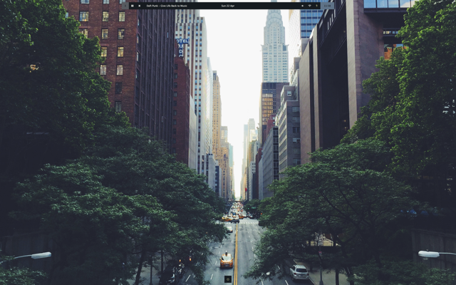
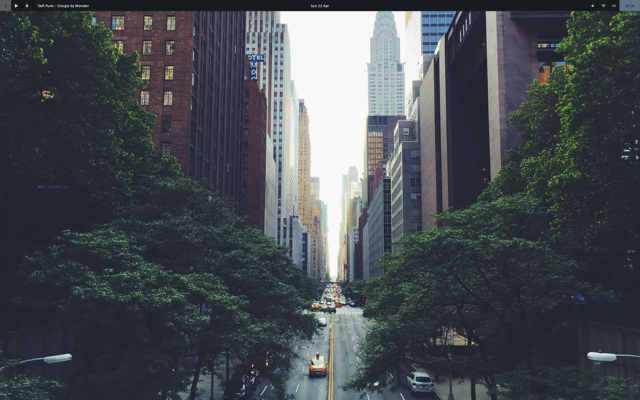
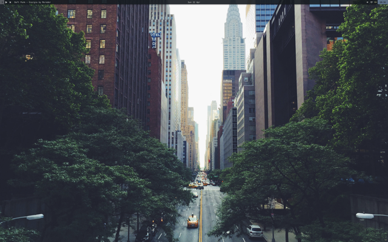
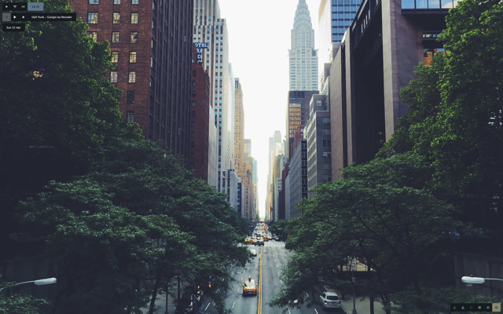
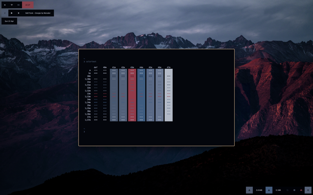
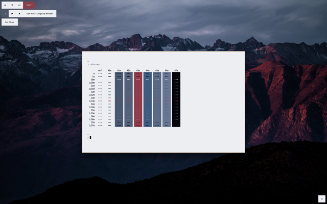
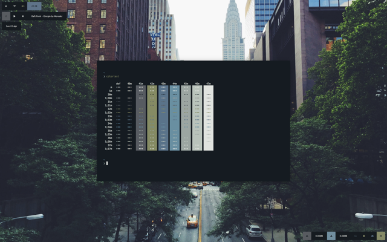
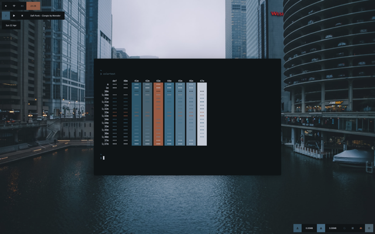

An extensible, customisable menubar replacement for macOS.
Built with Ubersicht.



The idea behing this widget is to put everything you might want to know at a glance to operate your computer in one place. From system monitoring, to currently playing music, supernerd, gives you an overview of everything you need to know, and it does it in a visually plasing and unobstrusive way.

## Yes but what does it do
Supernerd is still undergoing *very* active development – I'm adding, modifying, and moving around functions on a weekly basis. The list of displays that follows is indicative and relative only to the default configuration which can be very easily switched up with any of the other configuration files that are included in the download.

* Current Desktop
* Application Launcher
* Music playing on mpd (or iTunes / Spotify)
* Date and weather information
* Base system monitoring (volume, wifi, battery)
* Time
* Advanced system monitoring (network traffic, ram, cpu and HD usage)

## Eye candy and shit
I honestly have not seen any other menubar widget that is has this level of pointless and cool eye candy.

* **Adaptive Colors & Icons**   Want to master knowing what your mac is up to in a glance? Most of the indicators are color-coded, so the widget's colors reflect the load / usage / etc. System monitors, such as the CPU monitor change color as the get more loaded, the battery as it's drained, the volume as it lowers, etc. Icons are adaptive too where applicable: volume, battery, wifi, etc. all change to reflect their status.

* **Notification**              You can enable notifications and buttons will light up discreetly to let you know when there is one.

Does this really work? No! I'm still working on making it go off correctly.

Update: It's a lot harder than I thought, but it's on the to-do list

## Green policy & resource impact
Since tools like this one are most useful if you set it and forget it, making it run continuously, their biggest limitation is the resource overhead that they force onto you. **This is why I put a lot of consideration into developing supernerd with the least possible impact on system resources.** As a means of simple benchmarking, similar tools, when running without being actively used, can bring Ubersicht's average energy impact up to 25. In contrast, supernerd will usually keep it **well below 1**. This is accomplished by reducing the updates that the widget undergoes when drawn on your desktop via a mix of thoughful coding that can skip updates when they're not needed, and a reduction of it's overall refresh rate – the latter instrument reduces responsiveness, however, it does so in ways that are hard to notice if one isn't looking. Since not everyone has the same requirements and you might have more resources to spare, it's really easy to up the responsiveness – check the "usage" section for more info.

# Installation
(By this point we both know you want it.)
Please note that you might already have Brew, Ubersicht, or both, installed. In this case you can skip a step!

1. Install Brew. In a terminal,

run:
```ruby -e "$(curl -fsSL https://raw.githubusercontent.com/Homebrew/install/master/install)" < /dev/null 2>  /dev/null ; brew install caskroom/cask/brew-cask 2> /dev/null```

2. Install Übersicht.

Run:

```brew tap caskroom/cask```

```brew cask install ubersicht```


Alternatively, you can download it from [its own website](http://tracesof.net/uebersicht/), which I don't recommend. Learn to use brew. Brew is love, brew is life.

3. Install Supernerd.

Run:
```git clone https://github.com/blahsd/supernerd.widget $HOME/Library/Application\ Support/Übersicht/widgets/supernerd.widget```

## Desktop indicator setup
The desktop indicator and switcher relies on chunkwm. You can find all the necessary information here: https://github.com/koekeishiya/chunkwm

You can install it quickly through Homebrew, but I don't recommend installing it if you don't know what you are getting into, so check out the link above and take a reasoned decision. These are the homebrew commands:
```# clone tap
brew tap crisidev/homebrew-chunkwm

# install latest stable version
brew install chunkwm

# install from git repo
brew install --HEAD chunkwm
```

## Music indicator setup
The music indicator by default uses mpd/mpc. These are both installed easily through:
```brew install mpd

brew install mpc
```

If you don't want to use mpc/mcp, but would rather have the music indicator point to your iTunes or Spotify music, you should disable apps-and-music.coffee (for instance by renaming it to apps-and-music.coffee.optional) and enable apps-and-itunes.coffee.optional (by renaming it to apps-and-itunes.coffee).


## Weather widget setup
The weather widget needs further steps in order for them to work correctly. Skip it if you don't care for it.  DarkSky's free version (which is what the widget uses to fetch the weather information) only allows a limited number of calls to the API per day. This means that if enough of you fucks use my widget the way it was setup before (which is with my private API key) I myself don't get to use it no more. So you're gonna need to get your own private API key (free) here: https://darksky.net/dev and put it in scripts/weather-update.sh. You'll see where.

# Usage
Supernerd, by default, hides a lot of information from the user. This is in observance to the principle according to which you might want to have as little clutter as possible and only show what you actually need.

In order to achieve this, a lot of the indicators are hidden behind icons. There are two ways to interact with supernerd:

1. Disable your desktop, be liberated, and get the full supernerd experience
Lucky for you, in order to use all of the interactive shit, you must renounce interacting with your desktop icons. I know, I know. But since using your desktop like a 'put shit here' folder is not a good idea, this might actually help you. Do so:
`defaults write com.apple.finder CreateDesktop -bool FALSE;killall Finder`

When you're ready to revert back to your barbarian-like usage of your desktop/dumpster, do this:
`defaults delete com.apple.finder CreateDesktop;killall Finder`

2. Keep your desktop and interact with supernerd through Ubersicht's *Interaction Shortcut*.
If you don't want to disable your desktop, which I really can't see why you would want, you can still use Supernerd, although you miss out on some cool effects. It just means that you have to click on things while holding down Ubersicht's global interaction shortcut, which you can configure in Ubersicht's preferences.

## Customisation
We owe the customisability of Supernerd to the amazing work of [davidlday](https://github.com/davidlday). Thanks to him, Supernerd is now the only menubar replacement which employs .css files shared across all the widgets.

Supernerd is also fully compatible with wal / pywal.

The wiki has more detailed information on how the theme works so that you can easily hack into it and customise it as you like it.

Currently Supernerd ships with the following themes:
* mono



* middle


* flat



* floating



Too few themes? Not to worry. Thanks to its wal compatibility, supernerd can take on colors drawn from your wallpaper, allowing limitless customisation to your setup. All of the following screenshots where achieved with one line of code and a refresh:







# Credits
* [davidlday](https://github.com/davidlday/): this man gave us CSS separated from the code logic. He made it possible to have each widget split in a different file while maintaining the level of customisability we're used to. No way to thank him enough.

* [splintah/nerdbar.widget](https://github.com/splintah/nerdbar.widget): tons of code that I took shamelessly and adapted/expanded. Definitely would not have done supernerd if it wasn't for this code.

* [felixhageloh](https://github.com/felixhageloh/pretty-weather): shamelessly stole and mutilated the code that fetches and formats weather information from here.

* Me. I mean, I think I did a pretty good job. [Buy me a coffe](https://www.patreon.com/blahsd) or [thoughts & prayers](https://www.thoughtsandprayersthegame.com).
